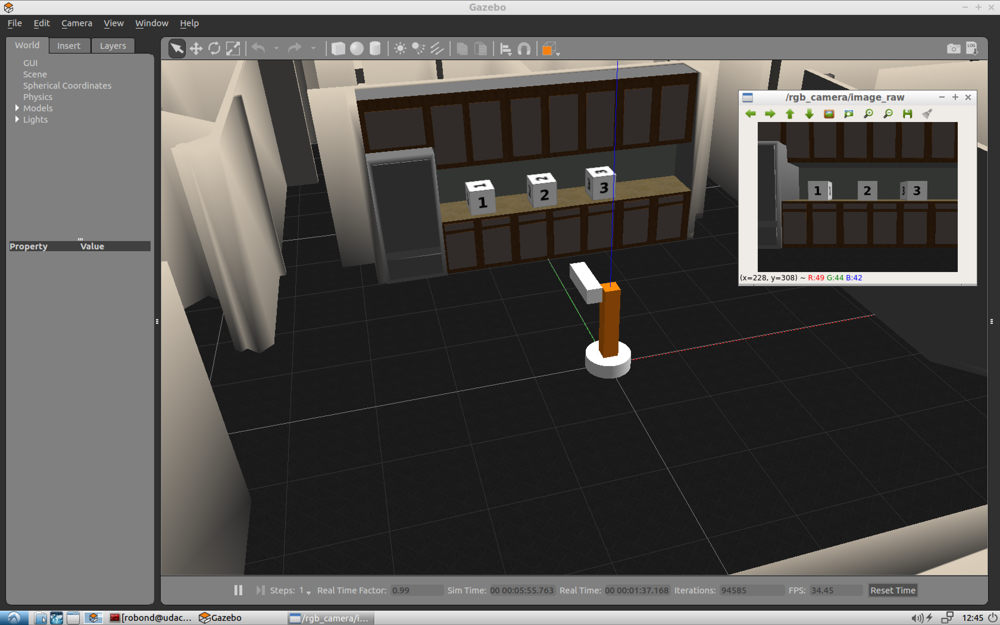

[](https://www.udacity.com/robotics)

# RoboND-simple_arm
A mini-project to better explain pub-sub architecture in ROS

## How to Launch the simulation?

#### Create a catkin_ws, feel free to skip if you already have one!
```sh
$ cd /home/workspace/
$ mkdir -p /home/workspace/catkin_ws/src/
$ cd catkin_ws/src/
$ catkin_init_workspace
$ cd ..
```

#### Clone the package in catkin_ws/src/
```sh
$ cd /home/workspace/catkin_ws/src/
$ git clone https://github.com/udacity/RoboND-simple_arm.git simple_arm
```

#### Build the `simple_arm` package
```sh
$ cd /home/workspace/catkin_ws/ 
$ catkin_make
```

#### After building the package, source your environment
```sh
$ cd /home/workspace/catkin_ws/
$ source devel/setup.bash
```

#### Make sure to check and install any missing dependencies
```sh
$ rosdep install -i simple_arm
```

#### Once the `simple_arm` package has been built, you can launch the simulation environment using
```sh
$ roslaunch simple_arm robot_spawn.launch
```

#### Interact with the arm using the safe_move service
Open a new terminal and type the following:
```sh
$ cd /home/workspace/catkin_ws/
$ source devel/setup.bash
$ rosservice call /arm_mover/safe_move "joint_1: 0.0 joint_2: 0.0"
```

## How to view image stream from the camera?
Camera image stream is published to the following topic:
```
/rgb_camera/image_raw
```

This stream can be viewed by following command in separate terminal:
```sh
$ rosrun image_view image_view image:=/rgb_camera/image_raw
```

## Simulation Interface:



